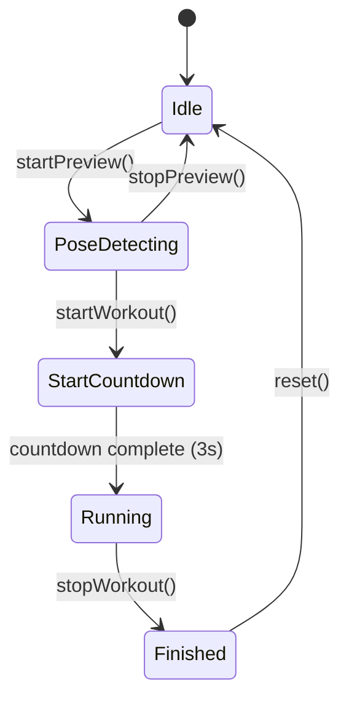
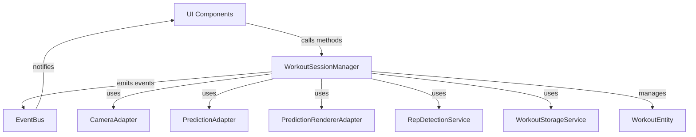
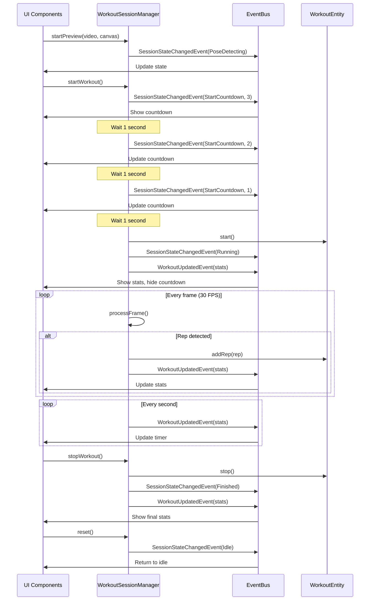

# KB Sport App Architecture

## State Machine



## Component Architecture



## Event Flow



## Directory Structure

```
src/
├── application/
│   ├── workout-session-manager.ts   # Main coordinator (NEW)
│   ├── events/
│   │   ├── camera-access-event.ts
│   │   └── model-loading-event.ts
│   └── services/
│       └── workout-storage.service.ts
│
├── domain/
│   ├── entities/
│   │   └── workout-entity.ts        # Pure data entity (UPDATED)
│   ├── events/
│   │   ├── session-events.ts        # Session state events (NEW)
│   │   └── workout-events.ts
│   ├── services/
│   │   ├── rep-detection.service.ts
│   │   └── rep-detection-state-machine.ts
│   └── types/
│       ├── rep-detection.types.ts
│       └── workout-storage.types.ts
│
├── infrastructure/
│   ├── adapters/
│   │   ├── camera.adapter.ts
│   │   ├── prediction.adapter.ts
│   │   └── prediction-renderer.adapter.ts
│   ├── event-bus/
│   │   ├── event-bus.ts
│   │   └── event.ts
│   ├── storage/
│   │   ├── opfs.adapter.ts
│   │   └── video-stream-writer.ts
│   └── model-loader.ts              # Simple model loader (NEW)
│
└── presentation/
    ├── app.tsx
    ├── hooks/
    │   ├── use-event-bus.ts
    │   └── use-model-loading.ts
    └── workout/
        ├── hooks/
        │   ├── use-workout-state.ts    # Subscribes to events (UPDATED)
        │   ├── use-workout-actions.ts  # Calls manager (UPDATED)
        │   └── use-frame-processing.ts # Now empty (UPDATED)
        └── components/
            ├── workout-controls.tsx    # Handles all states (UPDATED)
            └── workout-stats.tsx       # Shows during Running/Finished (UPDATED)
```

## Key Principles

### 1. Single Responsibility

- **WorkoutSessionManager**: Coordinates session lifecycle
- **WorkoutEntity**: Manages workout data and business rules
- **RepDetectionService**: Detects reps from pose predictions
- **Adapters**: Handle external concerns (camera, ML, rendering, storage)

### 2. Event-Driven

- All state changes emit events
- UI subscribes to events for reactive updates
- No direct coupling between layers

### 3. Type Safety

- TypeScript throughout
- Strict state machine transitions
- Type-safe event bus

### 4. Testability

- Pure domain logic (no side effects in entities)
- Dependency injection in manager
- Isolated state machine

## State Responsibilities

### Idle

- No camera active
- No workout data
- Waiting for user to start preview

### PoseDetecting

- Camera active
- Pose detection running
- Rendering skeleton overlay
- No rep counting
- No recording

### StartCountdown

- Countdown timer (3, 2, 1)
- Camera and pose detection still active
- Preparing to start workout

### Running

- Full workout active
- Rep detection enabled
- Video recording active
- Timer running
- Stats updating

### Finished

- Workout complete
- Stats displayed
- Video saved
- Waiting for reset
