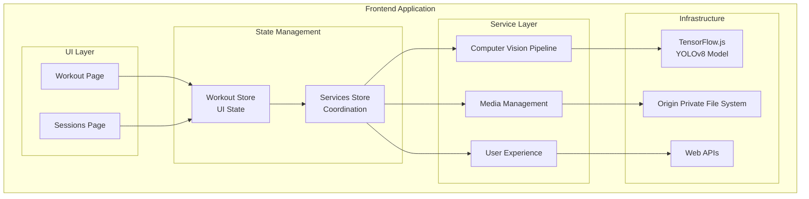
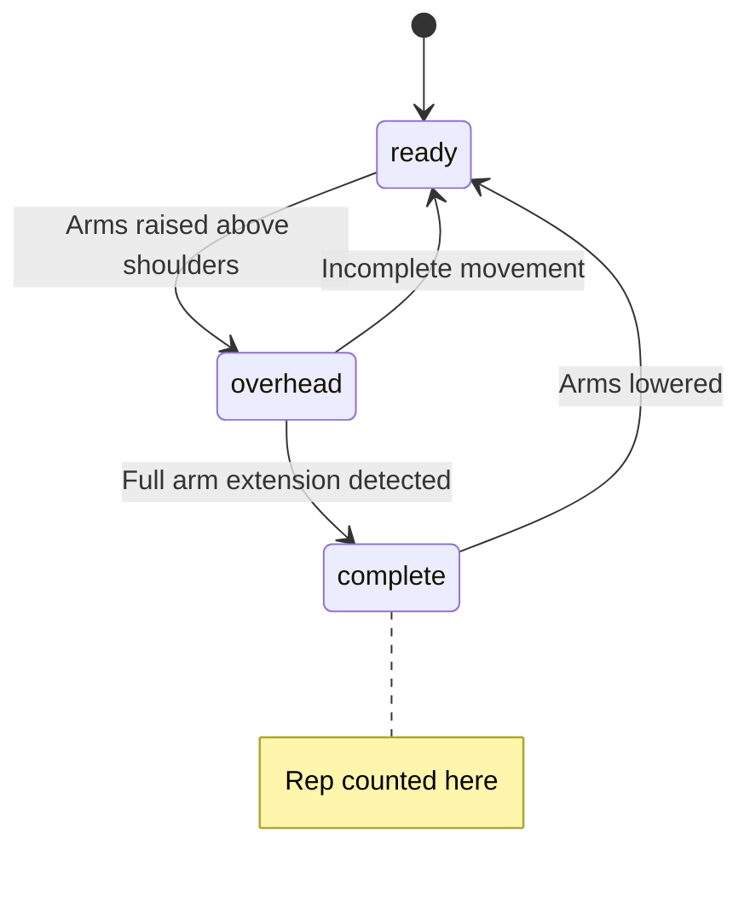
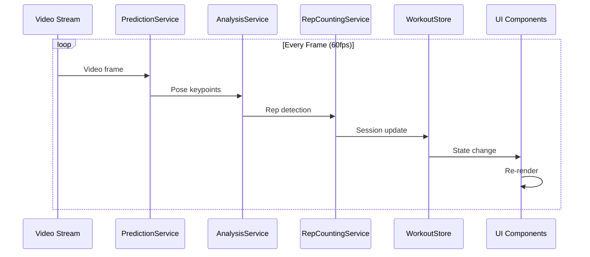

# Kettlebell Workout Tracker

A sophisticated real-time workout tracking application that uses computer vision to automatically detect and count kettlebell exercises. Built with modern web technologies for a smooth, responsive user experience.

## 🌟 Key Features

### Real-time Exercise Detection

- **YOLOv8 Pose Estimation**: Browser-based ML model for accurate pose detection
- **Automatic Rep Counting**: State machine-based algorithm for reliable exercise counting
- **60fps Processing**: Smooth real-time analysis with optimized performance
- **Visual Feedback**: Live pose overlay with keypoint visualization

### Audio Feedback System

- **Contextual Beeps**: Milestone notifications and countdown signals
- **Voice Announcements**: Rep count and RPM progress updates
- **Customizable Settings**: Configurable intervals and feedback preferences
- **Web Audio API**: Professional-quality audio synthesis

### Session Management

- **Local Storage**: OPFS-based persistence without server dependency
- **Video Recording**: Workout sessions recorded with overlay information
- **Detailed Analytics**: RPM tracking, timing analysis, and progress charts
- **Export Capabilities**: Download sessions and charts for external analysis

### Modern Architecture

- **Preact + TypeScript**: Type-safe, performant frontend development
- **Zustand State Management**: Lightweight, reactive state handling
- **Feature-based Organization**: Scalable architecture with clear separation
- **Service Layer Pattern**: Clean business logic with comprehensive testing

## 🚀 Quick Start

### Prerequisites

- Node.js 18+ and pnpm
- Modern browser with camera access
- OPFS support (Chrome 86+, Firefox 111+, Safari 15.2+)

### Installation

```bash
# Clone the repository
git clone <repository-url>
cd kb-sport-app

# Install dependencies
pnpm install

# Start development server
pnpm dev
```

### First Workout

1. **Grant Camera Permission**: Allow browser access to your camera
2. **Position Camera**: Set up camera to capture your full body movement
3. **Configure Settings**: Adjust countdown duration and audio preferences
4. **Start Workout**: Begin with the countdown timer
5. **Exercise Detection**: Perform kettlebell swings - reps counted automatically
6. **Review Session**: Check your workout history and performance metrics

## 🏗️ Architecture Overview



### Key Architectural Principles

- **Feature-based Organization**: Components grouped by business functionality
- **Service Layer Pattern**: Business logic separated from UI concerns
- **Reactive State Management**: Zustand stores for efficient state updates
- **Pure Service Architecture**: Testable, reusable business logic
- **Infrastructure Abstraction**: Clean separation from browser APIs

## 📋 Technology Stack

### Core Technologies

- **[Preact](https://preactjs.com/)**: Lightweight React alternative (3KB runtime)
- **[TypeScript](https://www.typescriptlang.org/)**: Full type safety throughout
- **[Vite](https://vitejs.dev/)**: Fast development and optimized builds
- **[Zustand](https://zustand-demo.pmnd.rs/)**: Minimal state management

### Specialized Libraries

- **[TensorFlow.js](https://www.tensorflow.org/js)**: Browser-based machine learning
- **[YOLOv8](https://ultralytics.com/yolov8)**: Real-time pose estimation model
- **[Recharts](https://recharts.org/)**: Workout data visualization
- **[OPFS](https://developer.mozilla.org/en-US/docs/Web/API/File_System_API)**: Modern local file storage

### Browser APIs

- **MediaDevices API**: Camera access and video streaming
- **MediaRecorder API**: Workout video recording
- **Web Audio API**: Professional audio feedback
- **Canvas API**: Real-time pose rendering
- **Speech Synthesis API**: Voice announcements

## 🧠 Computer Vision Pipeline

### YOLOv8 Pose Estimation

```typescript
// Real-time pose detection with 60fps performance
const { bestPrediction, transformParams } = predictionService.process(video);

// 17 COCO pose keypoints detected per person
const keypoints = [
  "nose",
  "left_eye",
  "right_eye",
  "left_ear",
  "right_ear",
  "left_shoulder",
  "right_shoulder",
  "left_elbow",
  "right_elbow",
  "left_wrist",
  "right_wrist",
  "left_hip",
  "right_hip",
  "left_knee",
  "right_knee",
  "left_ankle",
  "right_ankle",
];
```

### Rep Detection State Machine



### Performance Optimization

- **GPU Acceleration**: WebGL-based TensorFlow.js operations
- **Memory Management**: Automatic tensor cleanup with `tf.tidy()`
- **Frame Skipping**: Adaptive processing under resource constraints
- **Model Warm-up**: Pre-initialize inference pipeline

## 📊 Data Flow Architecture

### Real-time Processing Pipeline



### State Management Flow

- **Components** subscribe to specific store slices for optimal performance
- **Hooks** coordinate actions and provide clean component APIs
- **Services** handle business logic and external integrations
- **Stores** manage reactive state with immutable updates

## 🗂️ Project Structure

```
src/
├── features/                    # Feature-based organization
│   ├── workout/                # Real-time workout execution
│   │   ├── components/         # Workout UI components
│   │   ├── hooks/              # Workout-specific hooks
│   │   └── constants/          # Feature constants
│   └── sessions/               # Workout history management
│       ├── components/         # Session UI components
│       └── hooks/              # Session management hooks
├── shared/                     # Shared infrastructure
│   ├── components/ui/          # Reusable UI components
│   ├── store/                  # Zustand state management
│   ├── types/                  # TypeScript definitions
│   ├── constants/              # Application constants
│   └── utils/                  # Utility functions
├── service/                    # Business logic services
│   ├── prediction.service.ts   # ML model inference
│   ├── analysis.service.ts     # Rep detection logic
│   ├── camera.service.ts       # Camera management
│   ├── storage.service.ts      # OPFS file operations
│   └── audio-feedback.service.ts # Audio coordination
├── config/                     # Configuration files
└── app.tsx                     # Root component
```

## 🔧 Development

### Available Scripts

```bash
# Development
pnpm dev          # Start development server
pnpm build        # Production build
pnpm preview      # Preview production build
pnpm typecheck    # TypeScript validation

# Quality
pnpm lint         # ESLint validation
pnpm format       # Prettier formatting
pnpm test         # Run test suite
```

### Development Workflow

1. **Feature Development**: Work in feature-specific directories
2. **Service Testing**: Unit test business logic in service layer
3. **Component Testing**: Test UI components with mock dependencies
4. **Integration Testing**: Test complete workflows end-to-end
5. **Performance Testing**: Monitor real-time processing performance

### Model Export Process

```bash
# Export YOLOv8 model for browser usage
pip install ultralytics
yolo export model=yolov8n-pose.pt format=tfjs
```

## 📈 Performance Characteristics

### Real-time Processing

- **Target Frame Rate**: 60fps for smooth user experience
- **Processing Latency**: <16.67ms per frame (60fps threshold)
- **Memory Usage**: Efficient tensor management with automatic cleanup
- **GPU Utilization**: WebGL acceleration for ML operations

### Bundle Size

- **Total Bundle**: ~2.3MB gzipped (including ML model)
- **JavaScript**: ~416KB gzipped
- **YOLOv8 Model**: ~6MB (loaded asynchronously)
- **Runtime Size**: Preact (3KB) vs React (42KB)

### Storage Efficiency

- **Video Compression**: WebM format with optimized encoding
- **Metadata Storage**: JSON-based session information
- **OPFS Usage**: Efficient large file storage without server

## 🧪 Testing Strategy

### Unit Testing

- **Service Layer**: Business logic tested in isolation
- **Utility Functions**: Pure functions with comprehensive coverage
- **State Management**: Store actions and selectors tested

### Component Testing

- **UI Components**: Rendered with mock dependencies
- **Hook Testing**: Custom hooks tested with React Testing Library
- **Integration**: Feature workflows tested end-to-end

### Performance Testing

- **Frame Processing**: Monitor inference timing and memory usage
- **State Updates**: Measure re-render frequency and efficiency
- **Memory Leaks**: Validate proper cleanup of resources

## 📖 Documentation

Essential documentation is available in the [`docs/`](./docs/) directory:

- **[Architecture Guide](./docs/ARCHITECTURE.md)**: Core patterns and system design
- **[Development Guide](./docs/DEVELOPMENT.md)**: Setup and common development tasks
- **[Services Guide](./docs/SERVICES.md)**: Service responsibilities and APIs
- **[Workflow Guide](./docs/WORKFLOW.md)**: Complete service interaction flow from startup to workout completion
