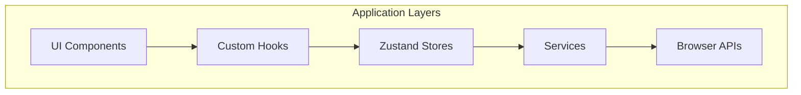

# Architecture Guide

## System Overview



## Core Architecture

### Two-Store Pattern
- **Workout Store**: UI state (countdown, errors, session data)
- **Services Store**: Infrastructure coordination (service instances, timers)

### Service Layer
- **PredictionService**: YOLOv8 ML inference
- **RepCountingService**: Exercise detection & statistics  
- **StorageService**: OPFS file operations
- **AudioFeedbackService**: Workout audio coordination

### Component Organization
```
src/
├── features/workout/    # Real-time workout execution
├── features/sessions/   # Workout history
├── shared/             # Reusable components & stores
└── service/            # Business logic services
```

## Key Patterns

### State Management
```typescript
// Components access state through selectors
const session = useWorkoutStore(state => state.currentSession);

// Services coordinate through store actions
const { startWorkoutSession } = useServicesStore();
```

### Service Coordination
```typescript
// Store orchestrates multiple services
startWorkoutSession: async (video) => {
  const { storageService, recordingService } = get();
  const { workoutId, videoWriter } = await storageService.createWorkoutSession();
  await recordingService.startRecording(workoutId, stream, videoWriter);
}
```

## Development Guidelines

1. **New Features**: Add to `src/features/[feature-name]/`
2. **Business Logic**: Create services in `src/service/`
3. **State**: Use appropriate store (UI state vs coordination)
4. **Components**: Keep focused with single responsibility
5. **Testing**: Unit test services, integration test workflows

## Performance Notes

- **Target**: 60fps real-time processing
- **Memory**: Auto cleanup with `tf.tidy()`
- **Bundle**: ~416KB JS + ~6MB ML model
- **Storage**: OPFS for video files, localStorage for settings