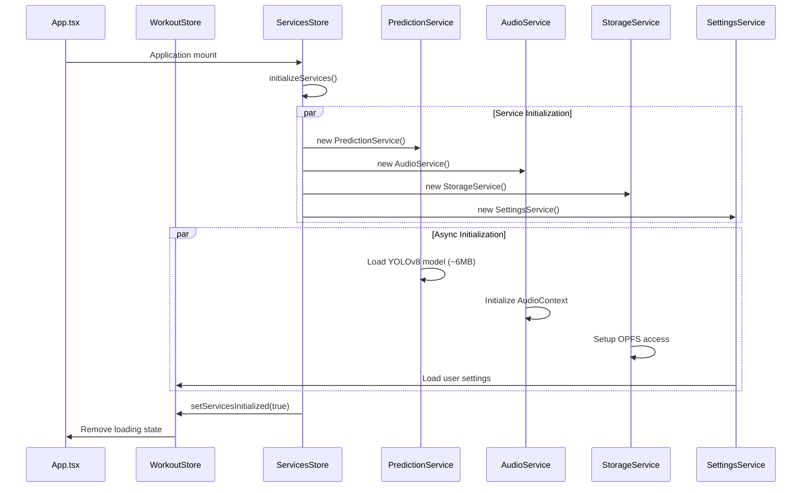
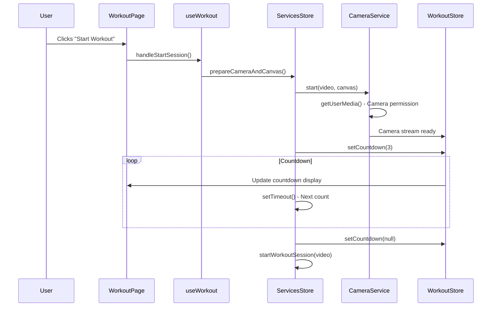
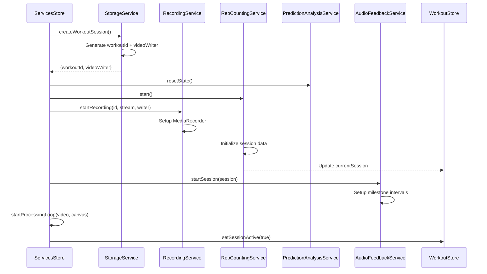
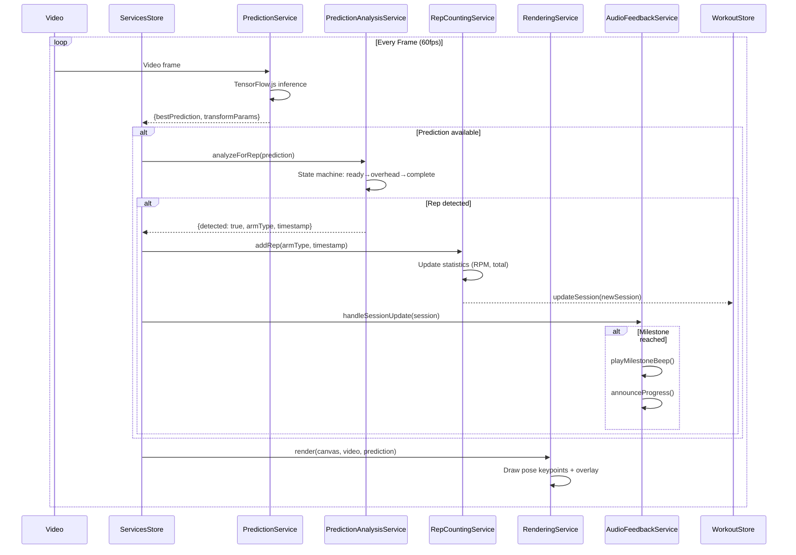
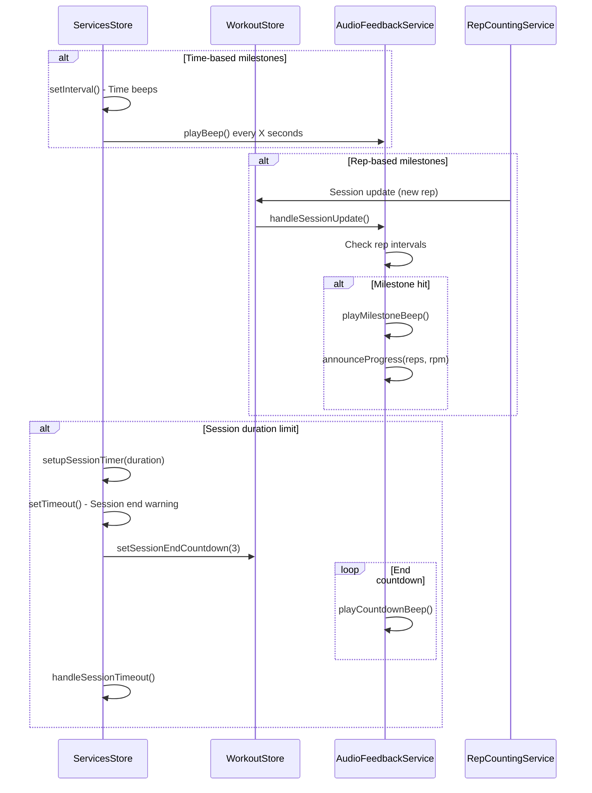
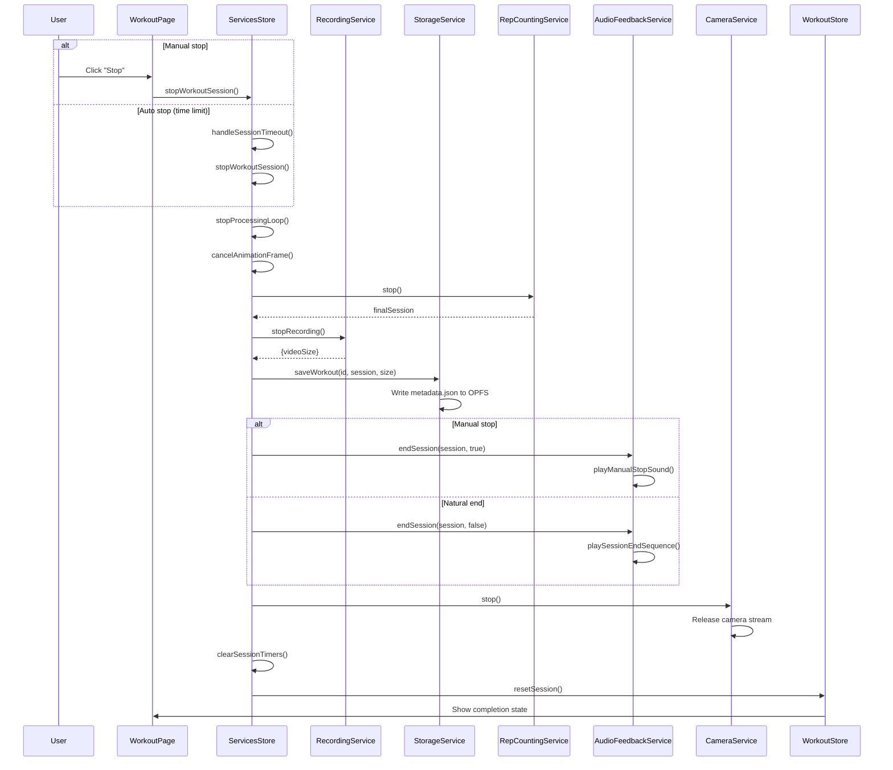
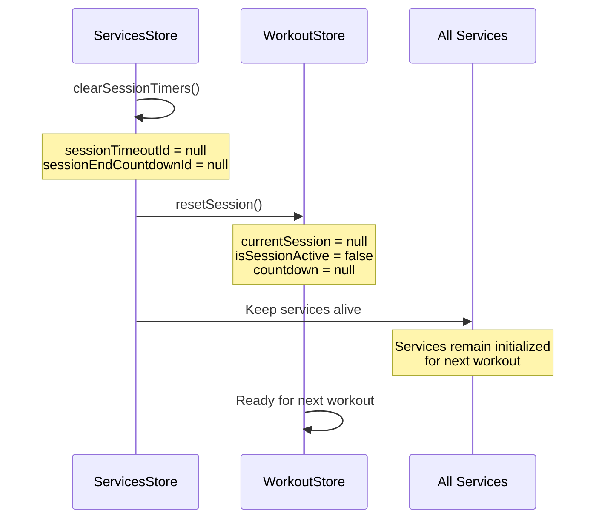

# Application Workflow: From Load to Workout

This document traces the complete service interconnection flow from application startup through workout completion.

## 1. Application Startup

### Key Events:
1. **Services Store Creation**: All service instances created
2. **Parallel Initialization**: Services initialize independently
3. **Model Loading**: YOLOv8 loads asynchronously (~5-10 seconds)
4. **Settings Loading**: User preferences restored from localStorage
5. **Ready State**: UI shows workout controls

## 2. Pre-Workout Setup

### Key Events:
1. **Camera Access**: Request user permission and setup video stream
2. **Canvas Setup**: Prepare rendering context for pose overlay
3. **Countdown Timer**: 3-second preparation countdown
4. **Audio Feedback**: Countdown beeps through AudioFeedbackService

## 3. Workout Session Start

### Key Events:
1. **Storage Setup**: Create unique workout ID and video file writer
2. **Service Reset**: Clear previous state from analysis and counting services
3. **Recording Start**: Begin MediaRecorder streaming to OPFS
4. **Audio Setup**: Configure milestone beeps and announcements
5. **Processing Loop**: Start 60fps frame analysis pipeline

## 4. Real-Time Processing Loop

### Key Events:
1. **ML Inference**: YOLOv8 processes each frame for pose keypoints
2. **Rep Detection**: State machine analyzes arm positions for exercise completion
3. **Statistics Update**: Rep counting service updates session data and RPM
4. **Audio Feedback**: Milestone beeps and progress announcements
5. **Visual Rendering**: Real-time pose overlay on video canvas

## 5. Session Management During Workout

### Key Events:
1. **Time Milestones**: Configurable beeps every X seconds
2. **Rep Milestones**: Audio feedback every X repetitions
3. **Progress Announcements**: Voice updates with rep count and RPM
4. **Session Timer**: Optional auto-stop after configured duration

## 6. Workout Session Stop

### Key Events:
1. **Processing Stop**: Cancel animation frame loop and processing
2. **Session Finalization**: Get final statistics from RepCountingService  
3. **Recording Stop**: End MediaRecorder and get final video size
4. **Data Persistence**: Save session metadata and video to OPFS
5. **Audio Completion**: Different sounds for manual vs automatic stop
6. **Resource Cleanup**: Release camera, clear timers, reset state

## 7. Cleanup and Reset

### Key Events:
1. **Timer Cleanup**: Clear all session-related timeouts
2. **State Reset**: Clear workout-specific state while preserving services
3. **Service Persistence**: Keep initialized services for immediate next use
4. **UI Reset**: Return to ready state for next workout

## Error Handling Throughout Workflow

### Service Initialization Errors
- **Model Loading Fails**: Show error, disable workout functionality
- **Camera Access Denied**: Show permission instructions
- **OPFS Not Supported**: Fallback to in-memory storage

### Runtime Errors
- **ML Inference Fails**: Continue with last known state, log warning
- **Recording Fails**: Continue workout, save metadata only
- **Storage Fails**: Keep session in memory, prompt for manual export

### Recovery Patterns
- **Graceful Degradation**: Non-critical features fail silently
- **User Feedback**: Clear error messages with recovery suggestions
- **State Consistency**: Always maintain valid application state

This workflow ensures robust service coordination while maintaining performance and user experience throughout the complete workout lifecycle.